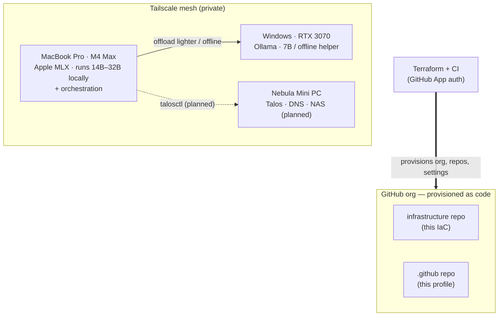

# local-homelab

> A personal homelab, managed entirely as code — from the GitHub org itself to
> the compute that runs local AI models.

Everything here is **infrastructure-as-code and GitOps-first**: changes are made
by editing Terraform and opening a pull request, not by clicking around a UI.
The GitHub organization you're looking at is itself provisioned by Terraform.

## Principles

- **Automate everything.** Every resource — including these org settings and
  repositories — is declared as code and applied through automation.
- **Least standing privilege.** Automation authenticates as a GitHub App that
  mints short-lived tokens; there are no long-lived personal access tokens.
- **Secrets never touch the repo.** Real values live only in local, gitignored
  files; only generic blueprints are committed.

## Architecture

- **AI compute is split across the mesh:** an Apple-Silicon MacBook (M4 Max)
  runs heavier reasoning/coding models locally via [MLX](https://github.com/ml-explore/mlx),
  and offloads lighter or offline 7B tasks to a GPU node running
  [Ollama](https://ollama.com/) — all over a private Tailscale mesh, with no
  ports exposed to the internet.
- **Control plane (planned)** moves to an always-on, low-power node running
  [Talos Linux](https://www.talos.dev/), also serving private DNS and NAS
  backup, managed entirely over its API.
- **The org** is defined in Terraform via the `integrations/github` provider —
  repos, branches, protection, secrets, and org settings.

## Tech stack

| Layer | Tooling |
| --- | --- |
| Infra-as-code | Terraform (`integrations/github`), GitHub Actions CI |
| Private network | Tailscale |
| Local AI | Apple MLX (Apple Silicon) + Ollama (GPU node) |
| Control plane (planned) | Talos Linux |

## Repositories

- **[infrastructure](https://github.com/local-homelab/infrastructure)** — the
  org-as-code Terraform and future homelab IaC layers.
- **.github** — this org profile and community-health files.

---

Built and run as a learning project. Managed as code, applied through CI.
